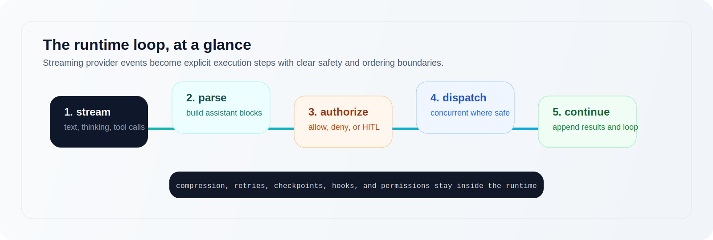

<h1 align="center">Wui</h1>

<p align="center">
  
</p>

<p align="center">
  <strong>An executor-first Rust runtime for LLM agents.</strong>
  <br />
  Stream text. Run tools. Pause for humans. Compress context. Keep the loop honest.
</p>

<p align="center">
  <a href="./docs/philosophy.md">Philosophy</a>
  ·
  <a href="./docs/architecture.md">Architecture</a>
  ·
  <a href="./docs/runtime-invariants.md">Runtime Invariants</a>
  ·
  <a href="./docs/tool-authoring.md">Tool Authoring</a>
</p>

<p align="center">
  
  
  
  
</p>

> The framework is an executor, not a thinker.

Wui is a Rust framework for building LLM agents with a small, explicit runtime core.
It focuses on the hard parts of execution: streaming output, tool scheduling,
permission flow, context pressure, and long-running sessions.

## Why It Feels Different

<table>
  <tr>
    <td width="33%">
      <strong>Loop-first</strong>
      <br />
      One honest runtime loop instead of a maze of hidden orchestration abstractions.
    </td>
    <td width="33%">
      <strong>Trust-aware</strong>
      <br />
      Human approval, readonly gates, and per-invocation permission checks are native.
    </td>
    <td width="33%">
      <strong>Extensions stay optional</strong>
      <br />
      Memory, MCP, observability, skills, and delegation live outside the core.
    </td>
  </tr>
</table>

## Hello, Agent

```rust
use wui::{Agent};
use wui::providers::Anthropic;

#[tokio::main]
async fn main() -> anyhow::Result<()> {
    let agent = Agent::builder(Anthropic::new(std::env::var("ANTHROPIC_API_KEY")?))
        .system("You are a helpful assistant.")
        .build();

    // Fire-and-forget: run a prompt, get the text back.
    let text = agent.run("What is the capital of France?").await?;
    println!("{text}");

    // Stream tokens as they arrive:
    agent.stream("Tell me a one-sentence joke.").print_text().await?;

    Ok(())
}
```

<p align="center">
  
</p>

## What Wui Optimizes For

- Streaming output and tool execution without turning the runtime into a graph DSL.
- Concurrent tools with per-invocation concurrency semantics.
- Human-in-the-loop that pauses cleanly and resumes cleanly.
- Graceful context compression when long runs approach model limits.
- Runtime-first persistence via session stores and checkpoints.
- Provider-specific tuning that stays with the provider instead of leaking into generic APIs.

## Design Stance

| Wui is | Wui is not |
|---|---|
| An executor-first agent runtime | A planner or orchestration framework |
| A stable vocabulary plus a focused runtime loop | A grab bag of prebuilt agent patterns |
| A place for execution semantics, safety, and recovery | A place to encode one product's worldview |
| A base layer you can build on top of | A replacement for your application architecture |

## Non-goals

Wui is deliberately scoped. These are things the framework does not do and does
not plan to do:

- Planning quality. The framework executes what the LLM decides. It does not evaluate whether the plan is good, correct, or optimal.
- World-model correctness. Wui does not verify that tool results reflect reality.
- Memory truth. Compression and summarization are lossy.
- Tool idempotency. If your tool needs exactly-once semantics, implement them in the tool.
- Multi-agent orchestration. Wui provides `SubAgent` and `wui-spawn`, not a consensus protocol or shared memory bus.
- Provider-specific optimization policy. Caching, batching, and routing belong in provider implementations.

## What Is Stable Today

| Crate | Status | Notes |
|---|---|---|
| `wui-core` | stable | Core traits: `Tool`, `Hook`, `Provider`, `TypedTool`. Semver protected. |
| `wui` | stable | Runtime loop, HITL, compression, permission, providers. |
| `wui-observe` | stabilizing | Timeline + OTel span emission. Minor API adjustments possible. |
| `wui-eval` | mixed | `MockProvider` stable; `ScenarioRunner` beta. |
| `wui-memory` | beta | Useful and tested, API may evolve. |
| `wui-mcp` | beta | Useful and tested, API may evolve. |
| `wui-spawn` | beta | In-process + transport-backed delegation. API may evolve. |
| `wui-skills` | beta | Useful and tested, API may evolve. |

`stable` means pinned versions will not break across patch releases.
`stabilizing` means the API is nearly final but minor adjustments are still possible.
`beta` means the crate is usable but method signatures may change.
`mixed` means some exports are stable while others are still evolving.

## Start Small

The shortest path to understanding Wui is to follow the examples in order:

1. [`examples/01-streaming`](./examples/01-streaming) - minimal streaming run
2. [`examples/02-run`](./examples/02-run) - `agent.run()` when you do not need events
3. [`examples/03-tools`](./examples/03-tools) - basic tool calling
4. [`examples/04-hitl`](./examples/04-hitl) - human approval flow
5. [`examples/05-hooks`](./examples/05-hooks) - external policy and observation
6. [`examples/06-session`](./examples/06-session) - multi-turn state
7. [`examples/07-concurrent`](./examples/07-concurrent) - concurrent tool execution
8. [`examples/08-readonly`](./examples/08-readonly) - readonly permission mode
9. [`examples/09-memory`](./examples/09-memory) - optional memory extension
10. [`examples/10-failure-kinds`](./examples/10-failure-kinds) - schema vs execution failures

New to Wui? Start with the `wui` crate only. Add extensions when the runtime
actually needs them.

## Crate Map

| Crate | Role | Maturity |
|---|---|---|
| `wui-core` | Vocabulary: traits, messages, events, tool outputs | stable |
| `wui` | Runtime executor plus public builder API | stable |
| `wui-observe` | Timeline capture and OpenTelemetry spans | stabilizing |
| `wui-eval` | Mock provider and test harnesses | mixed |
| `wui-mcp` | MCP bridge and lazy tool catalogs | beta |
| `wui-memory` | Reference memory capabilities | beta |
| `wui-spawn` | Agent delegation: in-process + pluggable transport | beta |
| `wui-skills` | File-based discoverable skill catalogs | beta |

## Provider Features

```toml
wui = { version = "0.1", features = ["anthropic"] }
wui = { version = "0.1", features = ["openai"] }
wui = { version = "0.1", features = ["full"] }
```

## Extension Snapshot

### Memory

```toml
wui-memory = "0.1"
```

```rust
use std::sync::Arc;
use wui_memory::{InMemoryStore, all_memory_tools};

let store = Arc::new(InMemoryStore::new());

let agent = Agent::builder(provider)
    .tools(all_memory_tools(store))
    .build();
```

`wui-memory` exposes capability traits such as `RecallBackend`,
`RememberBackend`, and `ForgetBackend`, plus reference in-memory backends for
development and tests.

### MCP

```toml
wui-mcp = "0.1"
```

```rust
use wui_mcp::McpClient;

let tools = McpClient::stdio("uvx", ["mcp-server-filesystem", "/tmp"])
    .await?
    .into_tools()
    .await?;

let agent = Agent::builder(provider).tools(tools).build();
```

Use `McpCatalog` when you want lazy tool discovery instead of putting every MCP
tool schema in the initial prompt.

### Observability

```toml
wui-observe = "0.1"
```

```rust
use futures::StreamExt;
use wui::AgentEvent;
use wui_observe::observe;

let mut obs = observe(agent.stream("Write a haiku."));

while let Some(event) = obs.next().await {
    if let AgentEvent::TextDelta(text) = event {
        print!("{text}");
    }
}

let timeline = obs.into_timeline();
println!("{}", timeline.summary());
```

### Delegation

```toml
wui-spawn = "0.1"
```

```rust
use wui_spawn::AgentRegistry;

let registry = AgentRegistry::new();

let supervisor = Agent::builder(provider)
    .tools(registry.delegation_tools("analyst", "Analyse data.", analyst))
    .build();
```

`wui::SubAgent` is synchronous delegation inside one turn. `wui-spawn` is
background delegation across turns.

### Skills

```toml
wui-skills = "0.1"
```

```rust
use wui_skills::SkillsCatalog;

let agent = Agent::builder(provider)
    .catalog(SkillsCatalog::new("./skills"))
    .build();
```

Each skill file becomes a discoverable tool that injects its contents as a
system reminder when activated.

## Codebase Reading Order

If you want to understand the framework itself, this is the shortest useful path:

1. [`docs/philosophy.md`](./docs/philosophy.md)
2. [`docs/architecture.md`](./docs/architecture.md)
3. [`docs/runtime-invariants.md`](./docs/runtime-invariants.md)
4. [`crates/wui-core/src/tool.rs`](./crates/wui-core/src/tool.rs)
5. [`crates/wui-core/src/provider.rs`](./crates/wui-core/src/provider.rs)
6. [`crates/wui/src/runtime/run/mod.rs`](./crates/wui/src/runtime/run/mod.rs)
7. [`crates/wui/src/runtime/executor.rs`](./crates/wui/src/runtime/executor.rs)

## License

MIT OR Apache-2.0
